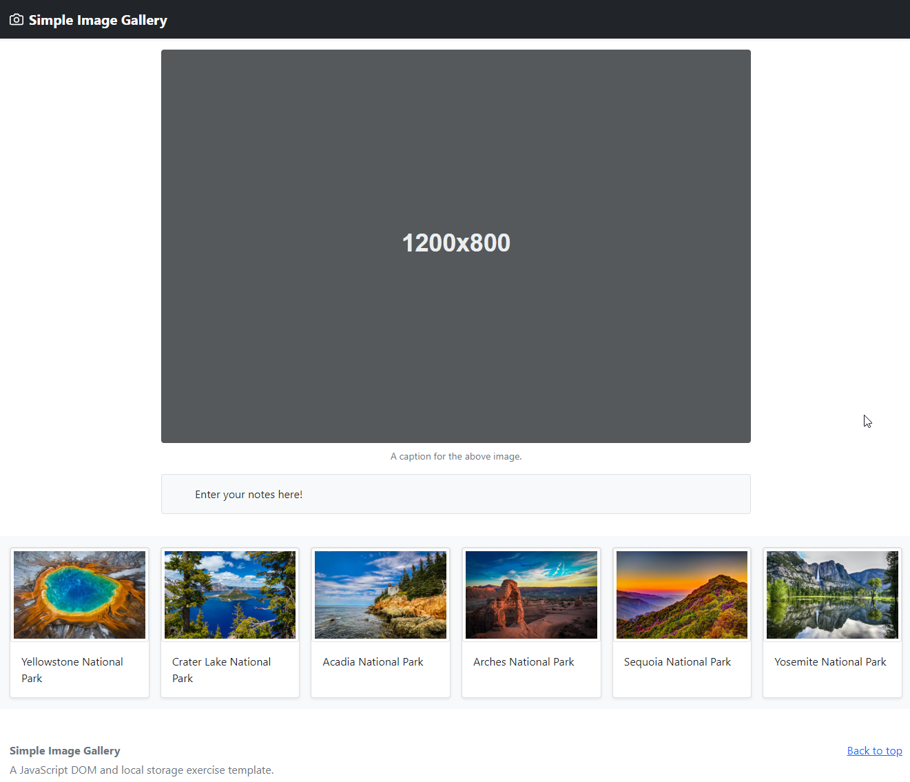
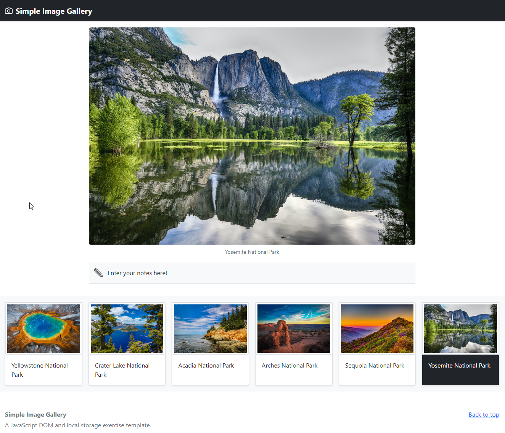
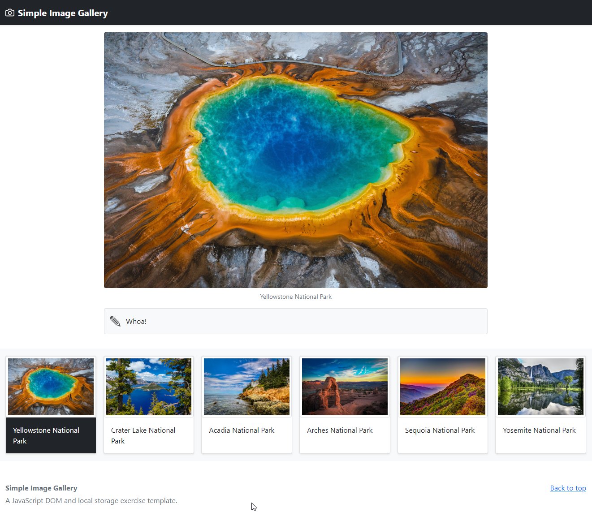

# Übung 3 – DOM, Event Listener und Local Storage

Es soll eine kleine Bildergalerie implementiert werden, die ihre Bilder mittels JavaScript-DOM austauscht. Eine einfache Local Storage-Implementierung ermöglicht die Speicherung von Notizen.

## Simple Image Gallery

In Ihrem Repository ist das Grundgerüst der Simple Image Gallery gegeben. Dieses enthält die HTML-Datei `index.html`, die dazugehörige CSS-Datei `css/main.css`, die JavaScript-Datei `_js/gallery.js` sowie sechs Bilder mit dazugehörigen Thumbnails (Vorschaubildern) und einigen weiteren Assets. Beim Klick auf einen der sechs Thumbnails, die als Bootstrap Karten (Cards, eine Kombination aus Bild + Text) realisiert sind, wird das dazugehörige große Bild geöffnet/angezeigt.

|  |
|:------------------------------------------------------------------------------------------------------------------------------------------------------------------------------------------:|
|                   ****                    |

Nun kann die Entwicklung starten. Vervollständigen Sie nun `_js/gallery.js`, sodass folgende Funktionalitäten für die Galerie gegeben sind:

### Platzhalter-Bild mit einem zufälligen Bild ersetzen

Am Beginn des `<main>`-Elements in `index.html` ist ein `<figure>`-Element platziert, das zunächst ein einfaches (SVG) Platzhalterbild enthält. An seine Stelle soll beim Laden der Seite eines der sechs großen Bilder treten. Dieses soll zufällig ausgewählt werden.

Dies geschieht in der Funktion `showRandomImageAtStart()`. In ihr wird aus den sechs großen Bildern – deren URLs bzw. Dateinamen sind in den Links auf den Thumbnail-Bildern verfügbar – ein Bild ausgewählt. Es ersetzt das Platzhalterbild.

Da der Wechsel des großen Bildes öfter benötigt wird, gibt es hierfür eine eigene Funktion. Sie heißt `switchFullImage(imageUrl, imageDescription)` und wird mit dem Pfad zur neuen Bilddatei und deren Beschreibung aufgerufen. Der Pfad wird verwendet, um das große Bild auszutauschen (d.h. das `src`-Attribut des ``-Elements zu ersetzen). Die Beschreibung wird für das `alt`-Attribut des Bildes und die Caption (Text des `<figcaption>`-Elements) benötigt. Die Beschreibung (der Name des Nationalparks im Bild) kann dabei entweder aus dem `alt`-Attribut des Thumbnails oder dem jeweiligen Kartentext entnommen werden.

Zusätzlich soll in den Cards der Thumbnails die korrekte (zum zufällig gewählten Bild passende) farblich hervorgehoben werden, um anzuzeigen, dass diese gerade aktiv ist. Setzen Sie dem Element mit der Klasse `.card-body` dazu die Klassen `.bg-dark` und `.text-white`.

|  |
|:------------------------------------------------------------------------------------------------------------------------------------------------------------:|
|                   **Ein zufälliges Bild wird statt des Platzhalters angezeigt und die Karte des aktuellen Bildes ist farblich markiert.**                    |

### Anzeigen/Wechsel des Bildes und der Bildunterschrift

Beim Klick auf ein Thumbnail-Bild wird die große Version des jeweiligen Bildes innerhalb des `<figure>`-Elements angezeigt. Dazu müssen Sie die Links auf die Thumbnails in der Funktion `prepareLinks()` so vorbereiten, dass bei einem Klick das entsprechende Bild im ``-Element innerhalb des `<figure>`-Elements angezeigt wird. Das zuvor dort angezeigte Bild wird ersetzt. Verwenden Sie dazu wieder `switchFullImage(imageUrl, imageDescription)`.

### Aktuelles Bild markieren

Wie schon bei der zufälligen Auswahl des Startbildes wird beim Klick auf ein Thumbnail-Bild die geklickte Karte farblich hervorgehoben. Dies muss ebenfalls in der Funktion `prepareLinks()` geschehen. Wiederum müssen Sie der aktuellen Karte die Bootstrap-Klassen `.bg-dark` und `.text-white`. setzen. Damit jedoch nicht nach mehrmaligen Klicks auf verschiedene Thumbnails jede Karte farblich hervorgehoben ist, müssen Sie vor dem Setzen der beiden Klassen diese zunächst präventiv entfernen, wenn sie bereits bei einem Element gesetzt sind.

### Notizen speichern und laden

Der Absatz unter dem großen Bild mit der ID `notes` kann aufgrund des Attributs `contenteditable` bearbeitet werden. Stellen Sie sicher, dass geänderter Text in diesem Feld lokal gespeichert wird, sobald das Feld seinen Fokus verliert bzw. der Inhalt des lokalen Speichers gelöscht wird, sobald der gesamte Text aus dem Feld gelöscht wurde (wird das Bild danach erneut angezeigt, erscheint wieder der Standardtext – siehe unten). Beides soll in der Funktion `storeNotes()` geschehen. Bedenken Sie, dass sie für jedes der sechs Bilder einen eigenen Schlüssel zur Speicherung wählen müssen, denn jeder Kommentar soll nur beim jeweiligen Bild angezeigt werden. Als Schlüssel eignet sich z.B. der Dateiname des aktuellen Bildes (da dieser einzigartig ist), es kann aber natürlich auch etwas Beliebiges gewählt werden.

Um dann in das Notizfeld eine zu einem Bild gespeicherte Notiz zu laden, implementieren Sie `loadNotes(key)`. Diese Funktion überprüft, ob unter dem übergebenen Schlüssel ein Eintrag im Local Storage existiert und setzt diesen als Inhalt des Notizfeldes. Besteht kein Eintrag (weil noch nichts editiert oder der Text zuvor gelöscht wurde), soll einfach der Standardtext "Enter your notes here!" angezeigt werden. Die Funktion wird schließlich auch in `prepareLinks()` aufgerufen, da die Abfrage auf Inhalte im Local Storage bei jedem Wechsel des Bildes geschehen muss.

|  |
|:-----------------------------------------------------------------------------------------------------------------------------------------------:|
|                   **Beim Bild ist eine Notiz gespeichert. Sie wird immer dann angezeigt, wenn dieses Bild ausgewählt wird.**                    |

## Tipps und Richtlinien

- Für Tüftler\*innen: Es ist möglich, anstatt sechs separater Event Listener nur einen einzigen zu verwenden und dieselbe Funktionalität zu erzielen. Der Schlüssel hierzu nennt sich *Event Bubbling*.
- Die Chrome DevTools und ähnliche Werkzeuge anderer Browser zeigen generierten JavaScript-Code an.
- MDN als Referenz für [JavaScript](https://developer.mozilla.org/en-US/docs/Web/JavaScript/Reference) und [DOM](https://developer.mozilla.org/en-US/docs/Web/API/Document_Object_Model) verwenden.

